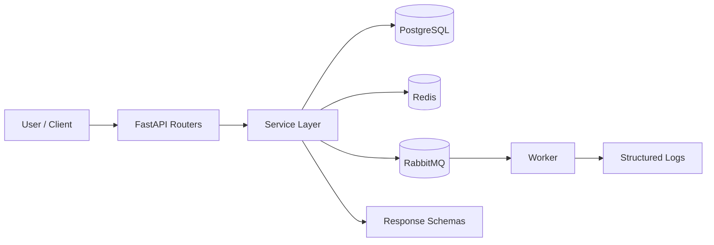

# Inventory Manager API

A backend REST API for managing product inventory, stock movements, and orders — built with **FastAPI**, **PostgreSQL**, **Redis**, and **RabbitMQ**, fully containerised with Docker.

---

## Tech Stack

| Layer         | Technology                         |
| ------------- | ---------------------------------- |
| API Framework | FastAPI + Uvicorn (async)          |
| Database      | PostgreSQL 16 + SQLAlchemy (async) |
| Migrations    | Alembic                            |
| Cache / Auth  | Redis 7 (refresh token storage)    |
| Messaging     | RabbitMQ 3.13 (low-stock alerts)   |
| Containers    | Docker + Docker Compose            |
| Testing       | Pytest + HTTPX (async test client) |
| Logging       | Structlog (structured JSON logs)   |

---


## Why this project

This project is built to show a real backend system, not just CRUD endpoints. It combines authentication, business rules, background processing, caching, and testing in one consistent codebase.

```text
Client
  ↓
FastAPI API
  ├─ PostgreSQL for source of truth
  ├─ Redis for cache + refresh tokens
  ├─ RabbitMQ for background events
  └─ Worker for low-stock processing
```

---


## Architecture Diagram



```text
Request flow
U -> Router -> Service -> Database / Redis / RabbitMQ -> Response
```

### Core components

- **Routers** handle HTTP only.
- **Services** own the business logic.
- **Utils** handle infrastructure helpers like JWT, Redis, and RabbitMQ.
- **Worker** consumes queue messages outside the API process.

---

## System Design Summary

### Why these services?

- **PostgreSQL** stores the source of truth for users, products, stock, and orders.
- **Redis** is used for fast auth/session storage and caching expensive read endpoints.
- **RabbitMQ** handles low-stock events without blocking HTTP requests.
- **Worker service** keeps background processing separate from the API.
- **Docker Compose** makes the whole stack reproducible locally.

### Why async?

- The API performs database I/O, cache I/O, and messaging I/O.
- Async lets FastAPI handle those waiting periods efficiently.
- That matters for a system with multiple services and many read requests.

```text
sync
request waits while I/O is idle

async
request can pause while the event loop handles other work
```

### Why a worker?

- The API should not block while processing non-HTTP side effects.
- Low-stock alerts can be handled after the stock change is committed.
- The worker demonstrates producer-consumer separation, which is common in real systems.

### Why Redis cache?

- Product lists and stock history are read often.
- Redis reduces repeated database work.
- Cache invalidation keeps cached data safe and accurate.

### Why service layer separation?

- It keeps routes thin and readable.
- Business rules stay in one place.
- Tests become easier because services can be checked without repeating HTTP logic.

---

## Key Design Choices

1. **Services own business logic** — routers only handle HTTP.
2. **One transaction per operation** — complex writes are committed once.
3. **Snapshots over live joins** — order and movement history store write-time values.
4. **Admin writes, any user reads** — permission model stays consistent.
5. **Publish after commit** — RabbitMQ messages are sent only after the DB write succeeds.
6. **Cache with explicit invalidation** — speed must never create stale data.
7. **Async SQLAlchemy everywhere** — matches the FastAPI async stack.
8. **Prefixed IDs** — easier to debug in logs and tests.
9. **Structured logging** — better observability and cleaner debugging.
10. **Tests use SQLite in-memory** — isolated, fast, and reliable.

---

## Features

- **JWT Authentication** — access + refresh tokens, Redis-backed revocation.
- **Products** — full CRUD with soft delete and SKU uniqueness.
- **Stock Movements** — RECEIVE / SHIP / ADJUST with immutable audit trail.
- **Orders** — atomic order creation with pre-flight stock validation.
- **Low Stock Alerts** — RabbitMQ message when stock drops below threshold.
- **Redis Caching** — cached product lists and stock history with invalidation.
- **Role-based Access** — admin vs regular user permissions per endpoint.
- **Pagination** — all list endpoints support `page` and `page_size`.

---

## Getting Started

### Prerequisites

- [Docker](https://docs.docker.com/get-docker/) and Docker Compose installed.

### 1. Clone the repo

```bash
git clone https://github.com/JHC-Oliveira/inventory-manager.git
cd inventory-manager
```

### 2. Set up environment variables

```bash
cp backend/.env.example backend/.env
```

Edit `backend/.env` and fill in your own values:

```bash
SECRET_KEY=your_random_32_char_string   # generate with: python -c "import secrets; print(secrets.token_hex(32))"
POSTGRES_PASSWORD=your_secure_password
RABBITMQ_PASSWORD=your_secure_password
```

### 3. Start all services

```bash
docker compose up --build
```

Docker starts **PostgreSQL → Redis → RabbitMQ → API → Worker** in the correct order with health checks.

### 4. Run database migrations

```bash
docker compose exec api alembic upgrade head
```

### 5. Open the API docs

[http://localhost:8000/docs](http://localhost:8000/docs)

---

## API Overview

### Authentication — `/auth`

| Method | Endpoint         | Auth | Description               |
| ------ | ---------------- | ---- | ------------------------- |
| POST   | `/auth/register` | None | Register a new user       |
| POST   | `/auth/login`    | None | Login, returns token pair |
| POST   | `/auth/refresh`  | None | Get new access token      |
| POST   | `/auth/logout`   | None | Revoke refresh token      |

### Products — `/products`

| Method | Endpoint         | Auth  | Description               |
| ------ | ---------------- | ----- | ------------------------- |
| POST   | `/products`      | Admin | Create a product          |
| GET    | `/products`      | User  | List products (paginated) |
| GET    | `/products/{id}` | User  | Get a single product      |
| PUT    | `/products/{id}` | Admin | Update a product          |
| DELETE | `/products/{id}` | Admin | Soft delete a product     |

### Stock — `/stock`

| Method | Endpoint                      | Auth  | Description                        |
| ------ | ----------------------------- | ----- | ---------------------------------- |
| POST   | `/stock/{product_id}/adjust`  | Admin | Adjust stock (RECEIVE/SHIP/ADJUST) |
| GET    | `/stock/{product_id}/history` | User  | Get movement history (paginated)   |

### Orders — `/orders`

| Method | Endpoint              | Auth  | Description                     |
| ------ | --------------------- | ----- | ------------------------------- |
| POST   | `/orders`             | User  | Create an order (deducts stock) |
| GET    | `/orders`             | User  | List orders (paginated)         |
| GET    | `/orders/{id}`        | User  | Get a single order              |
| PATCH  | `/orders/{id}/cancel` | Admin | Cancel order (restores stock)   |

---

## Current Architecture

### Backend flow

```text
HTTP request
  ↓
Router
  ↓
Service
  ├─ DB query/write
  ├─ Redis cache read/write
  └─ RabbitMQ publish after commit
  ↓
Schema response
```

### Why this layout works

It keeps the API easy to maintain. Routers stay small, services stay testable, and infrastructure logic stays isolated in utils.

---

## Project Structure

```text
inventory-manager/
├── README.md
├── docker-compose.yml
├── backend/
│   ├── .env
│   ├── .env.example
│   ├── alembic.ini
│   ├── Dockerfile
│   ├── pytest.ini
│   ├── requirements.txt
│   ├── requirements-dev.txt
│   ├── alembic/
│   │   └── versions/
│   ├── app/
│   │   ├── config.py
│   │   ├── database.py
│   │   ├── main.py
│   │   ├── dependencies/
│   │   ├── models/
│   │   ├── routers/
│   │   ├── schemas/
│   │   ├── services/
│   │   └── utils/
│   ├── tests/
│   │   ├── conftest.py
│   │   ├── test_auth.py
│   │   ├── test_orders.py
│   │   ├── test_products.py
│   │   └── test_stock.py
│   └── worker/
│       └── consumer.py
└── worker/
    ├── Dockerfile
    ├── main.py
    ├── pytest.ini
    └── tests/
        └── test_worker.py
```

---

## Environment Variables

See `backend/.env.example` for the full list. Key variables:

| Variable                      | Description                        |
| ----------------------------- | ---------------------------------- |
| `SECRET_KEY`                  | JWT signing key (keep secret)      |
| `DATABASE_URL`                | PostgreSQL async connection string |
| `REDIS_URL`                   | Redis connection string            |
| `RABBITMQ_URL`                | RabbitMQ AMQP connection string    |
| `ACCESS_TOKEN_EXPIRE_MINUTES` | JWT access token lifetime          |
| `REFRESH_TOKEN_EXPIRE_DAYS`   | JWT refresh token lifetime         |

---

## Security

- Passwords hashed with **bcrypt**.
- JWT tokens signed with **HS256**.
- Refresh tokens stored in **Redis** and revoked on logout.
- Swagger UI disabled in production (`DEBUG=false`).
- API runs as a **non-root user** inside Docker.
- CORS and TrustedHost middleware on every request.

---

## Testing

```bash
docker compose exec api pytest tests/ -v
```

Current backend test total: **79 passing tests**.

---

## What makes this resume-friendly

This project shows more than CRUD. It demonstrates:

- async FastAPI design;
- service-layer architecture;
- event-driven messaging with RabbitMQ;
- Redis caching with invalidation;
- transactional write handling;
- Dockerised local development;
- meaningful automated tests.